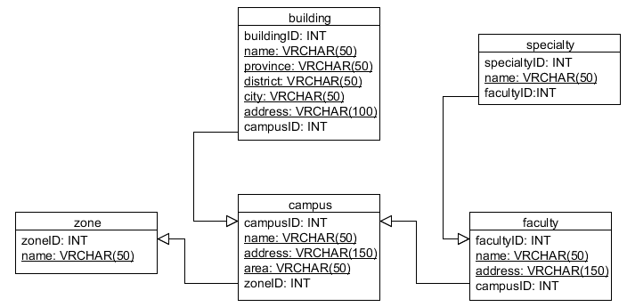
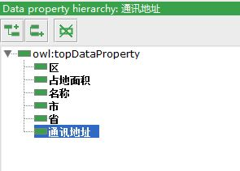

# report

#### 数据准备

数据基本统计信息：
1.	校区：3个
2.	校园：5个
3.	学院：58个
4.	专业：113种
5.	 楼：122栋

 - buliding表
 
 

 - campus表
 
 

 - faculty表
 
 
 
 - specialty表
 
 

 - zone表
 
 

#### 本体建模：owl文件，HermiT推理验证其连贯一致

#### 从关系型数据库到RDF: D2RQ
使用D2RQ写mapping.ttl文件，将关系型数据库映射为三元组格式并存储为N-Triple

得到sysu_add.nt文件

#### 使用jena-tdb将数据导入TDB

将.owl文件和.nt文件都读入同一个ontmodel（设为可推理的），并将其添加到一个TDB中，测试SPARQL查询。
